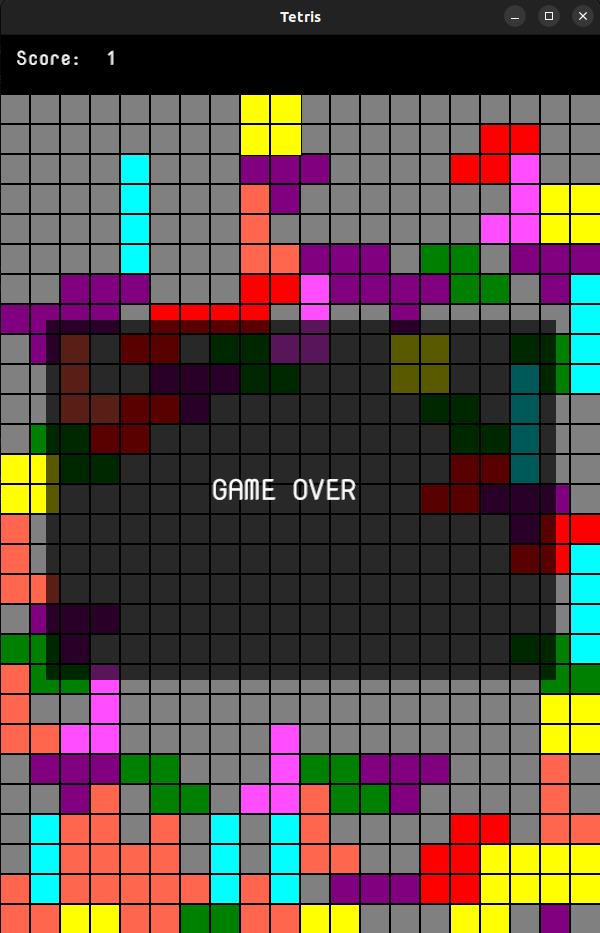

# Tetris: An implementation in Rust
This is a desktop application with the basic implementation of Tetris in Rust.

## Requirements
- [Rust](https://www.rust-lang.org/learn/get-started)
#### Crates used
- [piston_window](https://crates.io/crates/piston_window)
- [find_folder](https://crates.io/crates/find_folder)

## How to Run?
Simply download the project and execute `Cargo Run`

## How to play?
- Use the Left and Right arrow keys to move left and right across the board.
- Use the Down arrow key to speed up the drop.

## Future Enhancements
- Adding Tetromino rotations 
